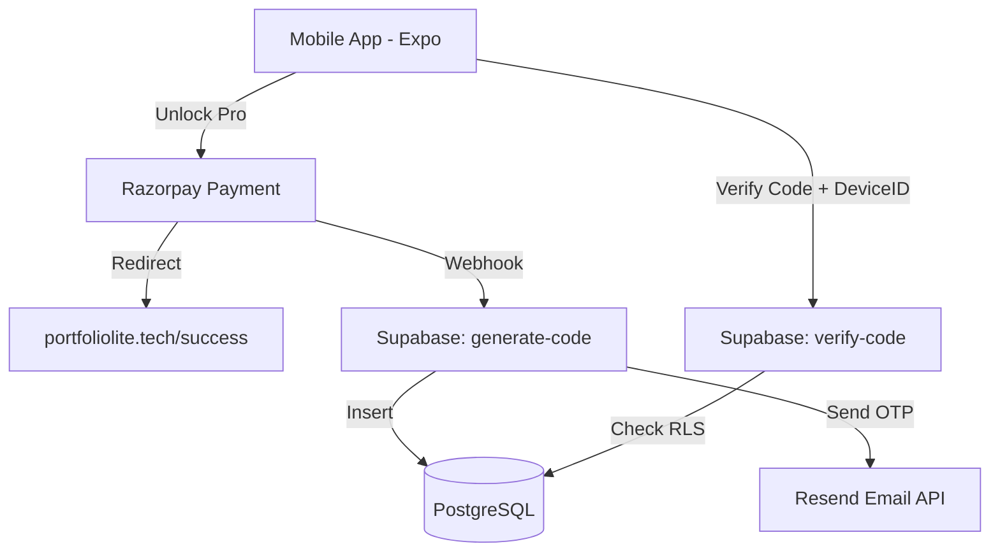

# 📱 PortfolioLite

**PortfolioLite** is a premium, cross-platform mobile application designed to empower professionals to manage and showcase their work seamlessly. Built with a focus on high-performance architecture, rock-solid security, and a frictionless user experience.

---

## 🚀 Key Engineering Highlights

This project demonstrates a full-stack engineering approach to mobile development, specifically addressing complex challenges in **Serverless Architecture**, **Payment Security**, and **License Management**.

### 🔐 1. Hardened License Verification System
Implemented a **Device-Tethered License Engine** using Supabase Edge Functions (Deno). 
- **The Challenge**: Prevent unauthorized sharing of "Pro" unlock codes across multiple devices.
- **The Solution**: Codes are cryptographically bound to unique hardware fingerprints upon first redemption. Subsequent verification requests are validated against stored `device_hint` signatures using PostgreSQL RLS policies.
- **Security Check**: Integrated **Rate-Limiting Middleware** that tracks and blocks IPs/Devices after 5 failed verification attempts to prevent brute-force code guessing.

### 💳 2. Resilient Payment Infrastructure
Engineered a secure, serverless bridge between **Razorpay** and **Supabase**.
- **Brute-Force ID Extraction**: Developed a robust parameter-parsing algorithm that scans inconsistent redirect payloads for transaction IDs, ensuring zero-drop redirected success flows.
- **Webhook Integrity**: Implemented HMAC SHA-256 signature verification for all incoming payment events, effectively eliminating "Double Spend" and "Spoofing" vulnerabilities.
- **Transactional Emails**: Automated mission-critical code delivery via **Resend API**, ensuring users receive their purchase proof within seconds.

### ⚡ 3. Performance & Scalability
- **Architecture**: Decoupled Frontend (Expo/React Native) from Backend (Supabase/PostgreSQL) for independent scaling.
- **Static Assets**: Success pages are hosted on GitHub Pages with 100/100 performance scores, custom-domain mapped to `portfoliolite.tech`.
- **Global Edge Network**: Leveraging Deno Deploy for low-latency response times globally.

---

## 🛠️ Tech Stack

- **Frontend**: React Native, Expo (SDK 52), Expo Router, Lucide Icons.
- **Backend/DB**: Supabase (PostgreSQL), Deno Edge Functions.
- **Payments**: Razorpay Integrated Webhooks.
- **Email**: Resend Transactional Email API.
- **Infrastructure**: Custom Domain Mapping (DNS), GitHub Pages.
- **Design**: Modern Dark Mode, Glassmorphism, Framer-inspired animations.

---

## 🏗️ Architecture Overview

---

## ⚙️ Setup & Installation

### Prerequisities
- Node.js & npm
- Expo CLI (`npm install -g expo-cli`)
- Supabase CLI

### Local Development
1. Clone the repository
2. Install dependencies: `npm install`
3. Start the dev server: `npx expo start`
4. Deploy Supabase Functions: `supabase functions deploy [function-name]`

---

## 🤵 Reviewer's Note
This project was built to test the limits of serverless security and cross-platform UX. From handling inconsistent payment link redirects to implementing IP-based throttling on the edge, every decision was made with **security**, **resiliency**, and **clean code** in mind.

Developed with ❤️ by **Umair**.
